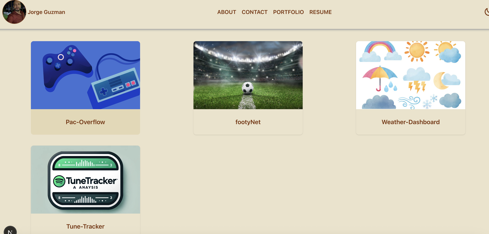
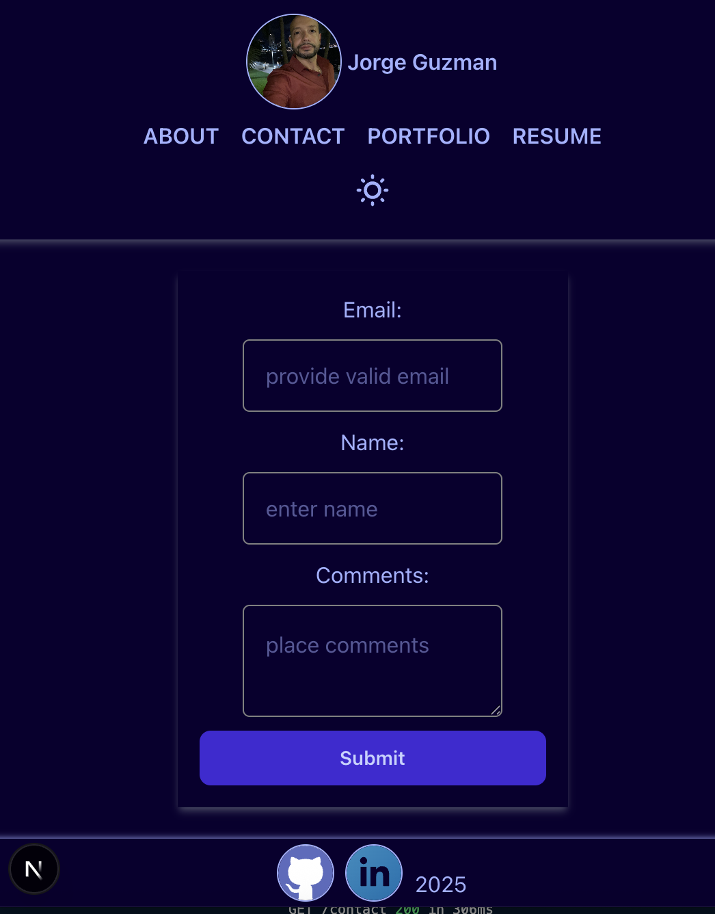

# Jorge's-Portfolio

 ## Table of Contents
- [Description](#description) 
- [Installation](#installation)
- [Usage](#usage)
- [Contributing](#contributing)
- [Contact](#contact)
 

  ## Description

  The purpose of this project is to create a profesional portfolio where potential employers can view my profile and projects

  

  

  
  website: https://jorgeguzman-portfolio.netlify.app/
  ## Installation

  To install, clone Github repository and install on local machine.
  
  ## Usage

  React along with next.js were used for this project.

  ## Contributing
  Jorge Guzman

  
  ## Contact
  Email: jguzman913@gmail.com

  Github: https://github.com/JGuzman87/
